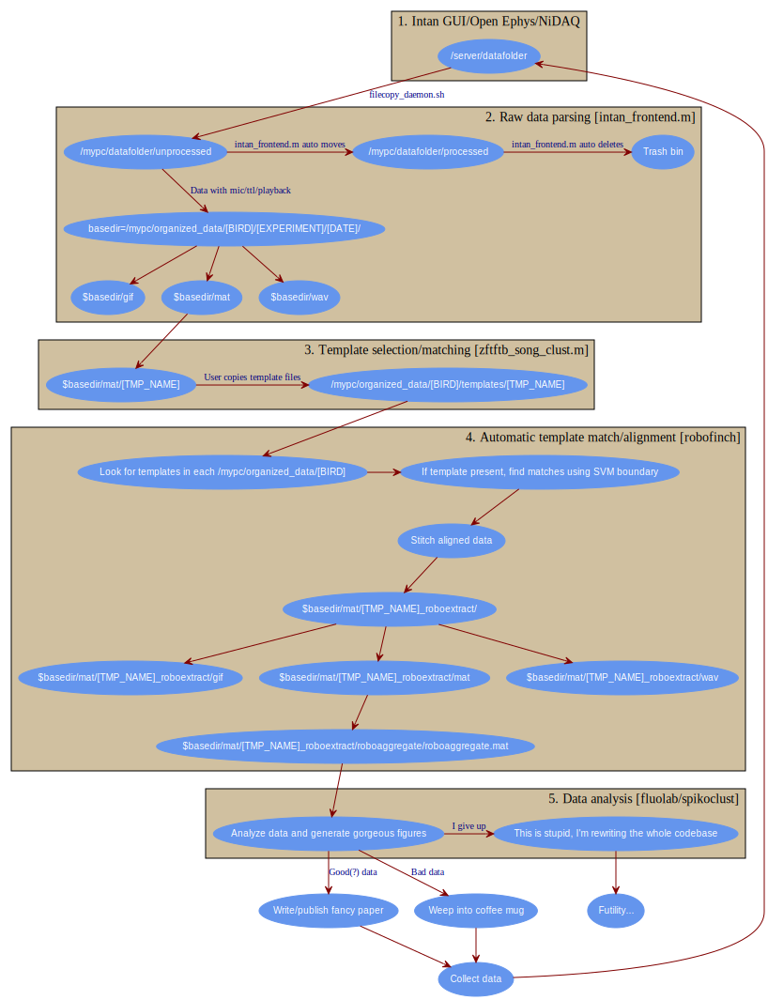
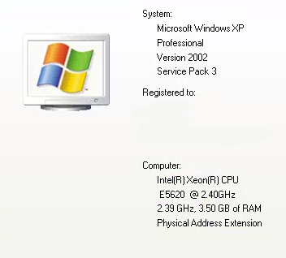
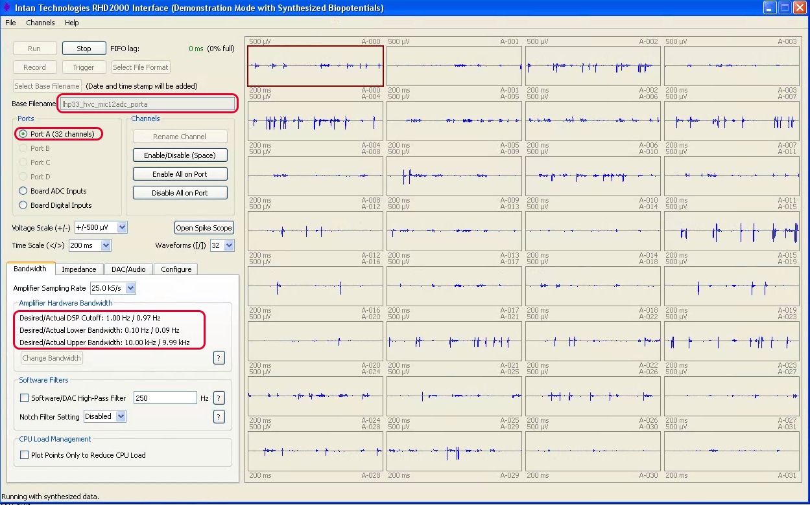

Experiments
===========

.. warning:: This contains broad overview of the software pipeline used for various experiments in the lab.  Note that this documentation does not dive deep into any one software package, it merely contains recipes for conducting analysis-heavy experiments in MATLAB.

The Virtuous Cycle
------------------

All of the mentioned experiments use a menagerie of MATLAB scripts (organized as sensibly as I could make them).  Visualized as a graph, things work as follows.

Electrophysiology in freely behaving songbirds using the Intan system
---------------------------------------------------------------------

Both the RHA and RHD versions of the Intan system are supported through various packages.  It is assumed that all recordings are performed in freely behaving animals, though various parts of the pipeline work perfectly well with other data types.  Here is the broad overview (also see the Virtuous Cycle mentioned above), with the code used for each step.

#.  Data is acquired on a "front-end" machine using the `RHA/RHD evaluation software <http://intantech.com/downloads.html>`_.  This is not resource intensive, most modern Intel machines with 3 GBs of RAM have worked fine.  PCs are simplest, but Linux/OS X will work just fine if you're willing to compile the Intan software. 
#.  Raw data files are then transfered to a "back-end" machine where all offline analysis is performed using a `simple bash script <https://github.com/jmarkow/data-handling>`_.  
#.  Once the files are transfered, processing begins with song detection. Files are processed for song and the resulting data is organizing using the `intan_frontend <https://github.com/jmarkow/intan_frontend>`_.  
#.  The user then selects a template from the song extractions.  Alignments to the template are performed using `zftftb <https://github.com/jmarkow/zftftb>`_.  First, the user performs a manual cluster cut in typically 1 day's worth of singing.  This trains a support vector machine (SVM, quadratic kernel) to recognize other examples of the template without user intervention.  
#.  Alignments and extractions of the rest of the data are now automated with the `robofinch framework <https://github.com/jmarkow/robofinch>`_.  Examples of the template are aligned for every day's worth of data. 
#.  Spike sorting is performed on aligned data using `spikoclust <https://github.com/jmarkow/robofinch>`_.  

The front-end
^^^^^^^^^^^^^

You won't need anything fancy for your front-end machine.  Shown above are the specs for my "workhorse" acquisition machine.  It's powerful enough to keep up with most acquisition equipment, that's about it.  

.. warning:: The software used to parse the raw data, `intan_frontend <https://github.com/jmarkow/intan_frontend>`_ reads metadata in the *filename itself*.  This was done for maximum compatability.  If you want to use this software pipeline obey the README of intan_frontend.   

1. You can use either the `Open Ephys GUI <http://www.open-ephys.org/gui/>`_ or the `Intan Demo software <http://intantech.com/>`_ .  Both should be fine, though I mostly used the Intan software (YMMV).  
2. Ephys is pretty straight-forward these days, plug everything in and start streaming some data.  
3. If you want to use the `intan_frontend <https://github.com/jmarkow/intan_frontend>`_ library, make sure to obey the filename conventions (detailed very explicitly in the repository's documentation). For example, if you are recording from two birds on port A and port B using the Intan RHD evaluation board, you might use the following base filename ``rm7_HVC_mic0adc_portA&lhp33_HVC_mic1adc_portB``.  This indicates that bird rm7 is on portA, the microphone can be found on adc channel 0, lhp33 is on port B and his mic is being routed to adc 1.  The software will append date and timestamps, which are automatically parsed by `intan_frontend <https://github.com/jmarkow/intan_frontend>`_.

.. warning:: If you routing a line-level microphone signal to an ADC on the RHD evaluation board, you *must* ensure the voltages are within an acceptable range, 0-3.3V.  There is a board specifically designed for this purpose:  `intan audio shifter <https://github.com/jmarkow/intan-audio-shifter>`_.

4. Above is a screenshot of an Intan RHD recording session using the Intan Demo software.  Some key settings are:
	#. Sampling rate: you should use at least 25 kHz here, especially if you are recording audio
	#. Adjust the upper bandwidth to half your sampling rate minus some headroom (e.g. 10 kHz when sampling at 25 kHz should be fine).
	#. Make sure the lower bandwidth is set to .10 Hz, you can always high-pass your data offline.  
	#. Deactivate any channels you are not using (e.g. if you're using a 16 channel headstage, you can deactivate all channels used for the 32 channel headstage only).
	#. Activate any adc channels are you using, e.g. adc-0 if you're recording the microphone on adc-0.	
	#. Set the filename using the appropriate conventions for `intan_frontend <https://github.com/jmarkow/intan_frontend>`_.
	#. Be sure to use the "conventional intan file format".  This is the deafult, but you can check ``Select file format`` to be sure.

The back-end (getting data)
^^^^^^^^^^^^^^^^^^^^^^^^^^^

1. First, you need to get the data from the acquisition computer to your analysis computer.  This is done using a simple bash script `filecopy_deamon.sh <https://github.com/jmarkow/data-handling>`_.  This assumes you're on a Mac or Linux machine for the offline analysis, or you're using a Bash emulator in Windows.  
2. In the bash terminal you will need to set your ``~/.bash_profile`` (see the repository documentation).  This can be done easily by issuing::
	
	$vim ~/.bash_profile

   or if vim isn't your thing::
	
	$nano ~/.bash_profile

3. Now you can clone the data-handling repository and symlink the script to somewhere on your PATH::
   
   	$cd ~/
   	$git clone https://github.com/jmarkow/data-handling
   	$ln -s data-handling/filecopy_daemon.sh /usr/local/bin

   If /usr/local/bin/ doesn't exist, create the directory and add to your PATH in .bash_profile.  Restart the terminal and you should simply be able to run::

   	$filecopy_daemon.sh

4. Once files with the appropriate extension are dumped into the DATAH_SRC directory, they will be moved into the DATAH_DEST directory once they haven't been written to for 5 minutes.

The back-end (intan_frontend.m)
^^^^^^^^^^^^^^^^^^^^^^^^^^^^^^^

.. warning:: By default, `intan_frontend <https://github.com/jmarkow/intan_frontend>`_ will move the raw data from DATAH_DEST to ``/DATAH_DEST/../processed/``, a directory that contains already-processed raw data.  Additionally, the sorted data is placed into ``/DATAH_DEST/../../intan_data/``.  These defaults can be changed by passing parameter/value pairs to the script.

#. Fire up MATLAB in your terminal::
	
	$matlab -nodisplay
   
   In OS X, if the matlab executable is not in your PATH, be sure to add it first::

   	ln -s /Applications/MATLAB_R[YOURVERSION].app/bin/matlab /usr/local/bin

   Restart the terminal and try issuing the first command again. If you're using Linux, you should be savvy enough to adjust the commands to work for your environment.

#. Navigate to DATAH_DEST, if you set it to /Volumes/MYHD/data/unprocessed::

	>>cd /Volumes/MYHD/data/unprocessed
	>>intan_frontend;

#. This starts the file parser with the default settings, which should be fine.  Check out the `documentation <https://github.com/jmarkow/intan_frontend>`_ for a list of all options.

The back-end (template selection/matching, zftftb)
^^^^^^^^^^^^^^^^^^^^^^^^^^^^^^^^^^^^^^^^^^^^^^^^^^

Data is pouring into ``/DATAH_DEST/../../intan_data/``.  You'll notice that files are organized as follows::

	intan_data/[BIRD]/[EXPERIMENT]/[DATE]/[gif|mat|wav]

#. The ``gif`` directory contains spectrograms of the microphone trace, ``mat`` contains all of the data aligned to the mic trace, and ``wav`` contains .wav files with the audio only.  ``gif`` and ``wav`` are mostly sanity checks, ``mat`` is where most of the action happens.  Open up MATLAB and navigate to the mat directory::

	>>cd intan_data/[BIRD][EXPERIMENT]/[DATE]/[mat]

#. Now you'll select a template and sounds that match it.  For details see `here <http://zftftb.readthedocs.org/en/latest/usage.html#sound-clustering>`_.  If you want to use your selection for automatic clustering later, be sure to set the ``train_classifier`` parameter to ``1`` or ``true``.  If you're unsure of how the ``audio_load`` parameter works, be sure to read over `this section of the zftftb documentation <http://zftftb.readthedocs.org/en/latest/usage.html#sound-clustering>`_. Now::

	>>zftftb_song_clust(pwd,'audio_load',my_audio_fun,'train_classifier',1);

This command will let you select a template, cluster the data, and train a classifier for automatic template matching.  

The back-end (automating alignments, robofinch)
^^^^^^^^^^^^^^^^^^^^^^^^^^^^^^^^^^^^^^^^^^^^^^^^^

Fiber photometry in freely behaving songbirds
---------------------------------------------

