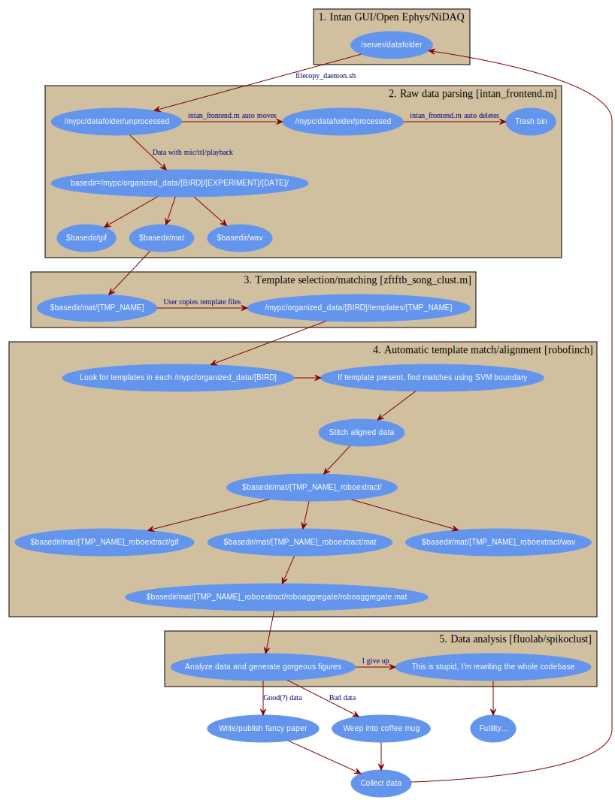

Experiments
===========

.. warning:: This contains broad overview of software pipeline used for various experiments in the lab.  Note that this documentation does not dive deep into any one software package, it merely contains recipes for conducting analysis-heavy experiment in MATLAB.

The Virtuous Cycle
------------------

All of the mentioned experiments use a menagerie of MATLAB scripts (organized as sensibly as I could make them).  Visualized as a graph, things work as follows.

Electrophysiology in freely behaving songbirds using the Intan system
---------------------------------------------------------------------

Both the RHA and RHD versions of the Intan system are supported through various packages.  It is assumed that all recordings are performed in freely behaving animals, though various parts of the pipeline work perfectly well with other data types.  Here is the broad overview (also see the Virtuous Cycle mentioned above), with the code used for each step.

#.  Data is acquired on a "front-end" machine using the `RHA/RHD evaluation software <http://intantech.com/downloads.html>`_.  This is not resource intensive, most modern Intel machines with 3 GBs of RAM have worked fine.  PCs are simplest, but Linux/OS X will work just fine if you're willing to compile the Intan software. 
#.  Raw data files are then transfered to a "back-end" machine where all offline analysis is performed using a `simple bash script <https://github.com/jmarkow/data-handling>`_.  
#.  Once the files are transfered, processing begins with song detection. Files are processed for song and the resulting data is organizing using the `intan_frontend <https://github.com/jmarkow/intan_frontend>`_.  
#.  The user then selects a template from the song extractions.  Alignments to the template are performed using `zftftb <https://github.com/jmarkow/zftftb>`_.  First, the user performs a manual cluster cut in typically 1 day's worth of singing.  This trains a support vector machine (SVM, quadratic kernel) to recognize other examples of the template without user intervention.  
#.  Alignments and extractions of the rest of the data are now automated with the `robofinch framework <https://github.com/jmarkow/robofinch>`_.  Examples of the template are aligned for every day's worth of data. 
#.  Spike sorting is performed on aligned data using `spikoclust <https://github.com/jmarkow/robofinch>`_.  

The front-end
^^^^^^^^^^^^^

.. figure:: figures/winshot_modded.png

You won't need anything fancy for your front-end machine.  Shown above are the specs for my "workhorse" acquisition machine.  It's powerful enough to keep up with most acquisition equipment, that's about it.  

.. warning:: The software used to parse the raw data, `intan_frontend <https://github.com/jmarkow/intan_frontend>`_ reads metadata in the *filename itself*.  This was done for maximum compatability.  If you want to use this software pipeline obey the README of intan_frontend, or   

#. You can use either the `Open Ephys GUI <http://www.open-ephys.org/gui/>`_ or the `Intan Demo software <http://intantech.com/>`_ .  Both should be fine, though I mostly used the Intan software (YMMV).
#. Ephys is pretty straight-forward these days, plug everything in and start streaming some data.
#. If you want to use the `intan_frontend <https://github.com/jmarkow/intan_frontend>`_ library, make sure to obey the filename conventions (detailed very explicitly in the repository's documentation). For example, if you are recording from two birds on port A and port B using the Intan RHD evaluation board, you might use the following base filename `rm7_HVC_mic0adc_portA&lhp33_HVC_mic1adc_portB`.  This indicates that bird rm7 is on portA, the microphone can be found on adc channel 0, lhp33 is on port B and his mic is being routed to adc 1.  The software will append date and timestamps, which are automatically parsed by `intan_frontend <https://github.com/jmarkow/intan_frontend>`_.

.. warning:: If you routing a line-level microphone signal to an ADC on the RHD evaluation board, you *must* ensure the voltages are within an acceptable range, 0-3.3V.  There is a board specifically designed for this purpose:  `intan audio shift <https://github.com/jmarkow/intan-audio-shifter>`_.

Fiber photometry in freely behaving songbirds
---------------------------------------------

